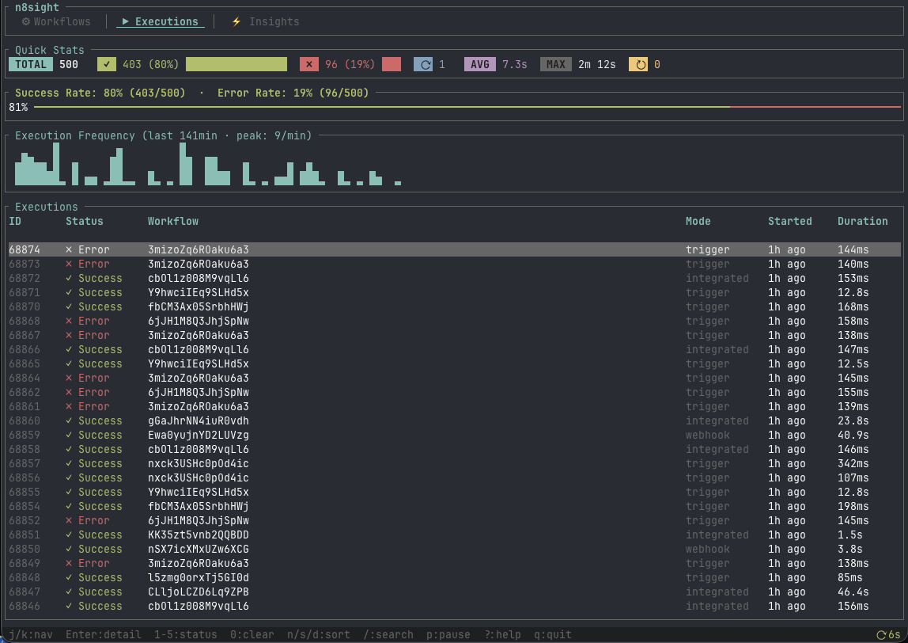
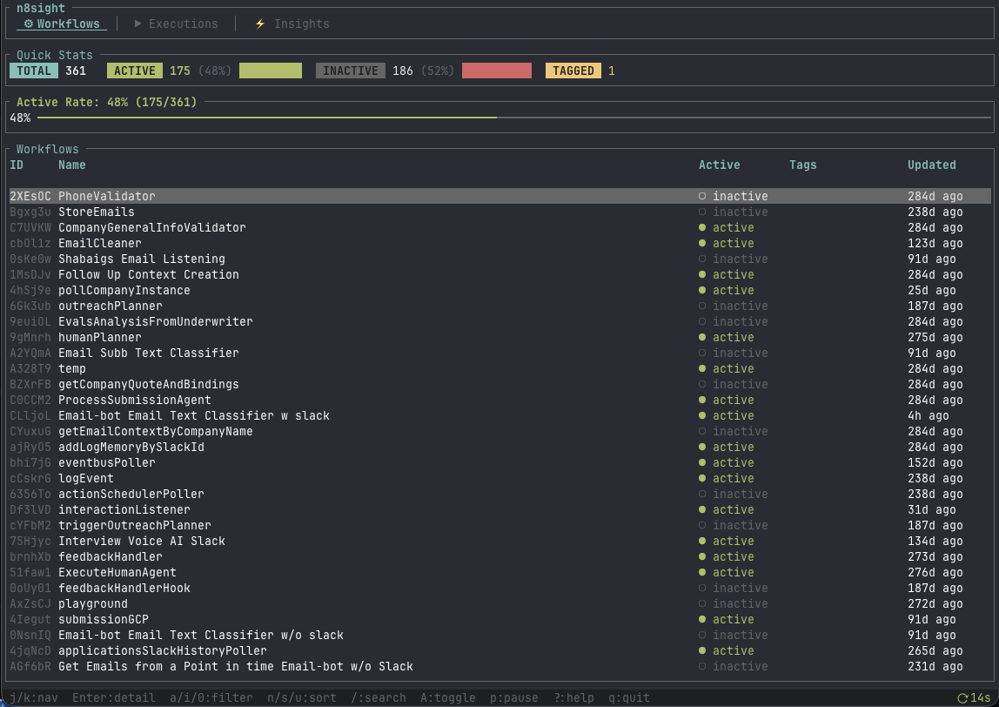
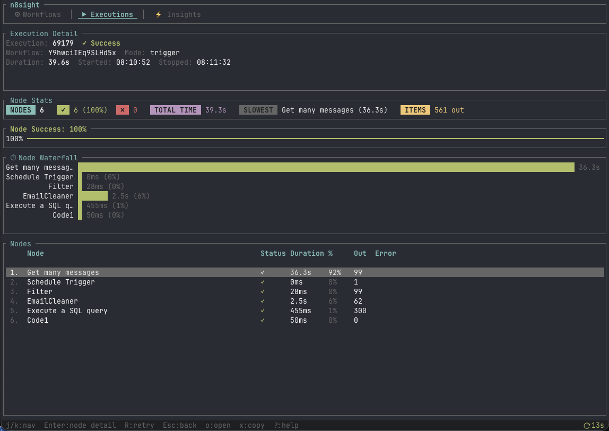
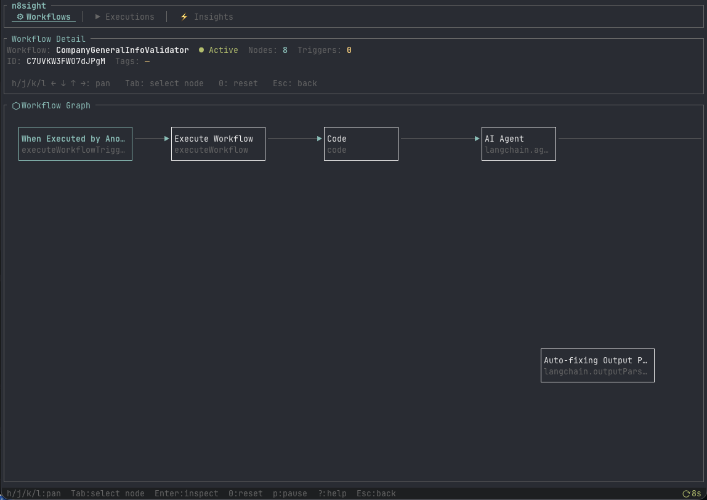
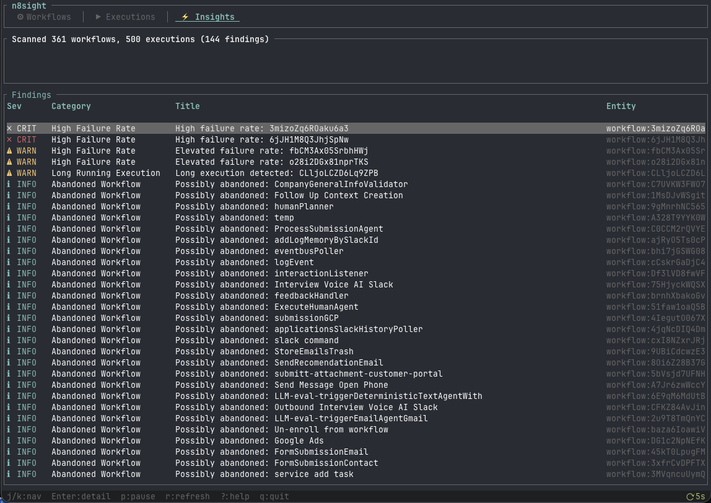

<p align="center">
  <h1 align="center">n8sight</h1>
  <p align="center">
    <strong>A real-time terminal dashboard for <a href="https://n8n.io">n8n</a></strong>
  </p>
  <p align="center">
    Monitor workflows. Track executions. Catch failures. Visualize your automation fleet — from the command line.
  </p>
  <p align="center">
    <a href="https://github.com/flancast90/n8sight/releases"></a>
    <a href="https://github.com/flancast90/n8sight/blob/main/LICENSE"></a>
    <a href="https://github.com/flancast90/n8sight"></a>
    <a href="https://www.rust-lang.org/"></a>
    <a href="https://ratatui.rs"></a>
  </p>
</p>

---

<p align="center">
  
</p>

## Why

n8n's web UI is great for building workflows. It's not great for monitoring a fleet of them.

When you have 20+ active workflows firing thousands of executions, you need:

- A dashboard that auto-refreshes and shows what's happening **right now**
- Failure rates, stuck executions, and retry storms surfaced **immediately**
- The ability to drill into any execution and see per-node timing at a glance
- Something that works over SSH, in tmux, without a browser

**n8sight is that.** One command. One binary. Zero dependencies.

## Screenshots

<details open>
<summary><strong>Workflows</strong> — fleet overview with active rate gauge and stats</summary>
<br>

</details>

<details open>
<summary><strong>Executions</strong> — live success rate, sparkline, and execution table</summary>
<br>

</details>

<details open>
<summary><strong>Execution Detail</strong> — node waterfall timeline with per-node stats</summary>
<br>

</details>

<details open>
<summary><strong>Workflow Graph</strong> — interactive ASCII node graph with pan and inspect</summary>
<br>

</details>

<details open>
<summary><strong>Insights</strong> — fleet health scan: failures, stuck executions, abandoned workflows</summary>
<br>

</details>

## Install

```bash
git clone https://github.com/flancast90/n8sight.git
cd n8sight
cargo build --release
# Binary at ./target/release/n8s
```

> Requires [Rust](https://rustup.rs) 1.75+. Single binary, no runtime dependencies.

## Setup

### 1. Get your API key

Go to your n8n instance → **Settings → n8n API** → **Create an API key**

### 2. Create config

**macOS**: `~/Library/Application Support/n8sight/config.toml`
**Linux**: `~/.config/n8sight/config.toml`

```toml
api_url = "https://your-instance.example.com"
api_key = "your-api-key-here"
```

Or use environment variables:

```bash
export N8N_API_URL=https://your-instance.example.com
export N8N_API_KEY=your-api-key-here
```

### 3. Launch

```bash
n8s          # dashboard connected to your instance
n8s --mock   # demo mode with fake data
```

## Features

| Feature | Description |
|---|---|
| **Auto-refresh** | Updates every 15s. Press `p` to pause/resume. Countdown in the corner. |
| **Workflows** | Active/inactive stats, active rate gauge, sortable & filterable table |
| **Executions** | Success rate gauge, execution frequency sparkline, status filters |
| **Waterfall** | Per-node execution timeline showing where time was spent |
| **Node graph** | Interactive ASCII workflow visualization with pan & node inspect |
| **Node inspect** | Full parameter JSON (scrollable), connections, credentials |
| **Fleet insights** | Auto-detects: high failure rates, stuck executions, retry storms, abandoned workflows |
| **Keyboard-driven** | Vim-style navigation. No mouse needed. |

## Keyboard shortcuts

<details>
<summary><strong>Navigation</strong></summary>

| Key | Action |
|---|---|
| `j`/`k` or `↑`/`↓` | Move up/down |
| `g`/`G` | Top/bottom |
| `Enter` | Drill into detail |
| `Esc` | Go back |
| `Tab` | Cycle tabs (or nodes in graph) |
| `Alt+1`/`2`/`3` | Jump to Workflows/Executions/Insights |

</details>

<details>
<summary><strong>Filtering & sorting</strong></summary>

| Key | Context | Action |
|---|---|---|
| `/` | Any list | Text search |
| `a`/`i`/`0` | Workflows | Active / Inactive / Clear |
| `1`–`5` / `0` | Executions | Error/Running/Success/Waiting/Canceled / Clear |
| `n`/`s` | Any list | Sort by name / status |
| `u` | Workflows | Sort by updated |
| `d` | Executions | Sort by duration |

</details>

<details>
<summary><strong>Actions</strong></summary>

| Key | Action |
|---|---|
| `r` | Manual refresh |
| `p` | Pause/resume auto-refresh |
| `A` | Activate/deactivate workflow |
| `R` | Retry failed execution |
| `x` | Copy URL to clipboard |
| `o` | Open in browser |
| `?` | Help overlay |
| `q` (×2) | Quit |

</details>

<details>
<summary><strong>Graph view</strong></summary>

| Key | Action |
|---|---|
| `h`/`j`/`k`/`l` or arrows | Pan |
| `Tab` | Select next node |
| `Enter` | Inspect selected node |
| `0` | Reset pan |
| `Esc` | Back |

</details>

<details>
<summary><strong>Node inspect</strong></summary>

| Key | Action |
|---|---|
| `j`/`k` | Scroll parameters |
| `d`/`u` | Page down/up |
| `g`/`G` | Top/bottom |
| `n`/`N` or `Tab`/`Shift+Tab` | Next/previous node |
| `Esc` | Back to graph |

</details>

## n8n API coverage

| Endpoint | Used for |
|---|---|
| `GET /workflows` | Workflow list with filtering |
| `GET /workflows/{id}` | Full detail: nodes, connections, graph |
| `POST /workflows/{id}/activate` | Activate from TUI |
| `POST /workflows/{id}/deactivate` | Deactivate from TUI |
| `GET /executions` | Execution list with status filtering |
| `GET /executions/{id}?includeData=true` | Per-node execution data |
| `POST /executions/{id}/retry` | Retry from TUI |

## Architecture

```
src/
  main.rs            Entry point. TUI-only. Effect processing loop.
  app.rs             State machine — update(action) → effects
  action.rs          Action enum (inputs) + Effect enum (outputs)
  scroll_state.rs    Generic scrollable list with TableState
  cli_worker.rs      Async API serializer via mpsc channels
  config.rs          Layered config: CLI flags > env > file
  client/            N8nClient trait + HTTP + mock
  domain/            Models, insight algorithms
  widgets/           Graphs, gauges, sparklines, tables, waterfalls
```

## Contributing

```bash
cargo run -- --mock   # TUI with fake data
cargo test            # run tests
cargo clippy          # lint
cargo fmt             # format
```

See [CONTRIBUTING.md](CONTRIBUTING.md) for architecture guide.

## License

MIT — [Finn Lancaster](https://github.com/flancast90)
